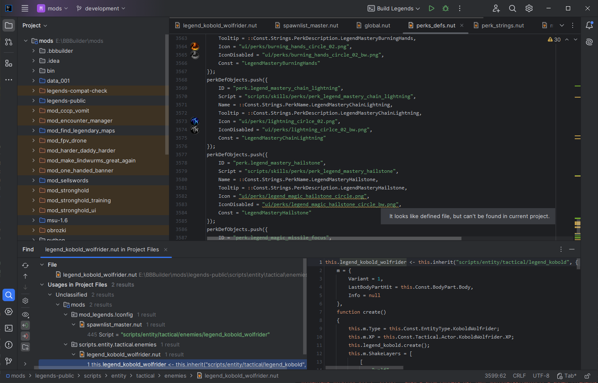
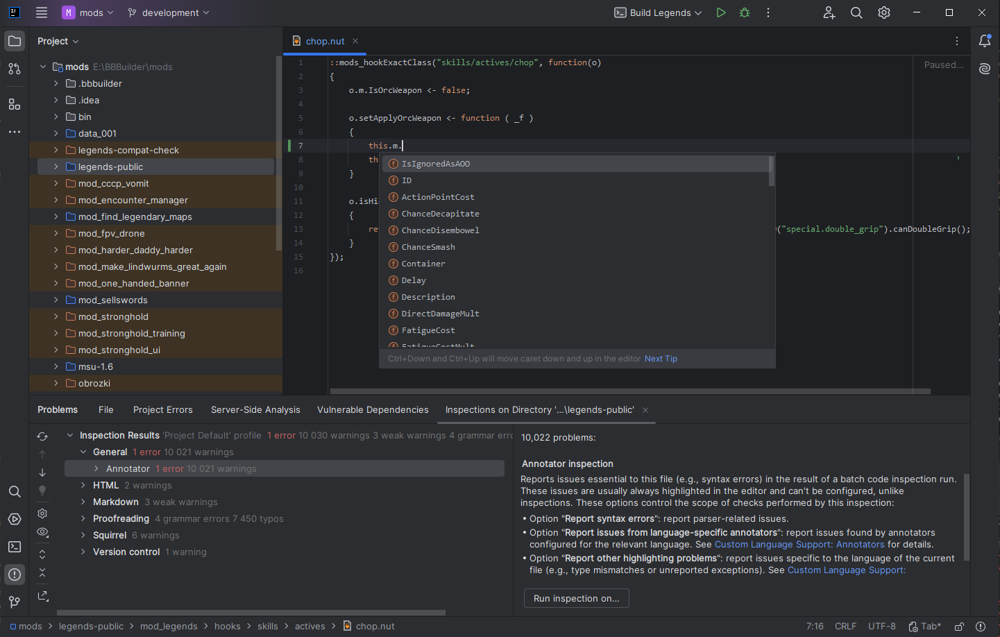
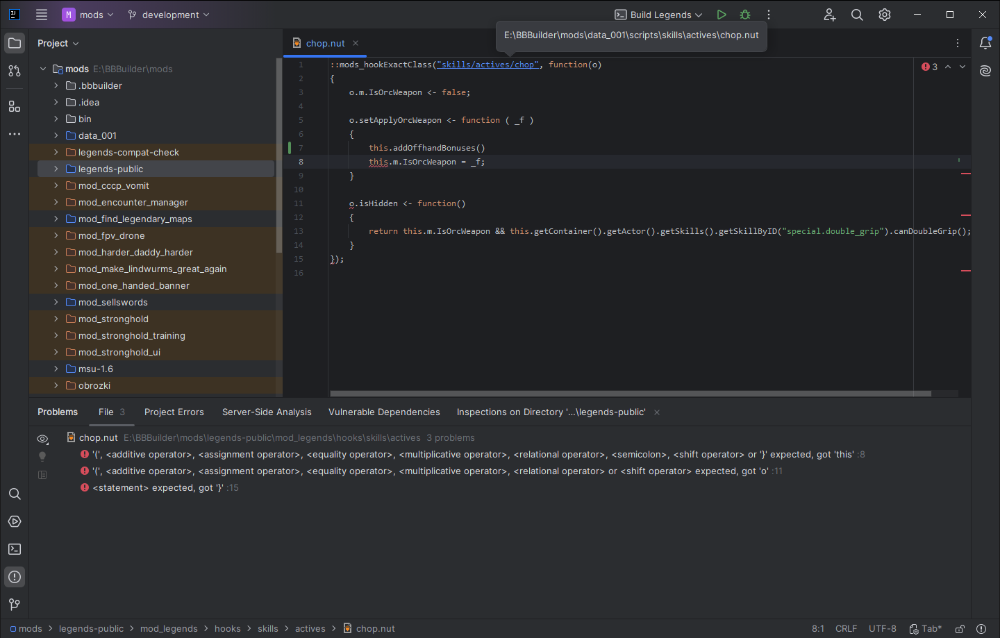

# BB Squirrel Intellij plugin

Adds support for version of Squirrel used in Battle Brothers game, plus modding helpers.

Roughly based on original Squirrel plugin for Intellij [README.md](ORIGINAL_README.md), but mostly rewritten from scratch.

## Installation

* Get Intellij IDEA with version at least 2025.1, Community or Ultimate, doesn't matter
* Uninstall old Squirrel IDE plugin
* Download the latest zip from the [releases page](../../releases).
* Follow the [install plugin from disk](https://www.jetbrains.com/help/idea/managing-plugins.html) instructions
* Add unpacked vanilla to the project and mark as source `Right click | Mark directory as | Sources root`
* Mark mod directories as sources `Right click | Mark directory as | Sources root`
* Mark mods or build directories you don't want indexed as `Excluded`
* If completion doesn't work, rebuild indexes `File | Invalidate caches | check first 2 options `
* Create `.stub` directory in your project and copy `stub/stub_engine.nut` from this repo into that directory, mark as source. This will add global functions and objects provided by the engine to code completion lookup

## Features

- Supports multi-mod environment by tracking references in all relevant mods,
- Reworked BNF based parser to fit BB version of Squirrel better,
    - NOTE: It's stricter when it comes to syntax than ingame interpreter, but is a bit more lenient than vanilla code is.
    - To check if there are syntax error, add it as source, then on mod `Right click | Analyze | Inspect Code`, it's requirement for code completion to work
- New file templates for classes and modding related stuff
- Code highlighting
- Code formatter
- BB aware .nut file structure validation
- Block folding
- Live code validation and various on-demand inspections
- Code completion for BB classes, modding hooks and modern hooks, also non-dynamic global variables,
    - for sanity only in `::` and `gt.` spaces, `this.` is too ambiguous to resolve references consistently, refactor to `::`
- Find usage on 'class' names, to quickly find all hooks and references in code
- String reference tracking (scripts, hooks and gfx files)
- Images and colors used in code show on gutter
- Marking directories as sources/exclude affects reference resolution scope
- ... more coming? maybe

## Contributions

It's MIT, feel free.

## Plugin development prerequisites

* Java 21
* IntelliJ

## Plugin development environment

* Install [Grammar-Kit](https://plugins.jetbrains.com/plugin/6606-grammar-kit) for `*.bnf` and `*.flex` file support
  * Adds BNF Grammars and JFlex files editing support including parser/PSI code generator
* Clone repository
* Follow instructions on the plugin development environment setup [page](https://www.jetbrains.org/intellij/sdk/docs/tutorials/build_system/prerequisites.html)
  * Enable the *Gradle* plugin
  * Enable the *Plugin DevKit*
* Use `File | New… | Project from Existing Sources` and open the cloned repository directory

### Testing the plugin locally

* Run the Gradle `runIde` task which will start a new IntelliJ instance with the plugin installed.
* Install [PsiViewer](https://plugins.jetbrains.com/plugin/227-psiviewer) on that instance to see how files are structured (`Tools | View PSI structure for Current File...`). It helps greatly when changing code in plugin.
